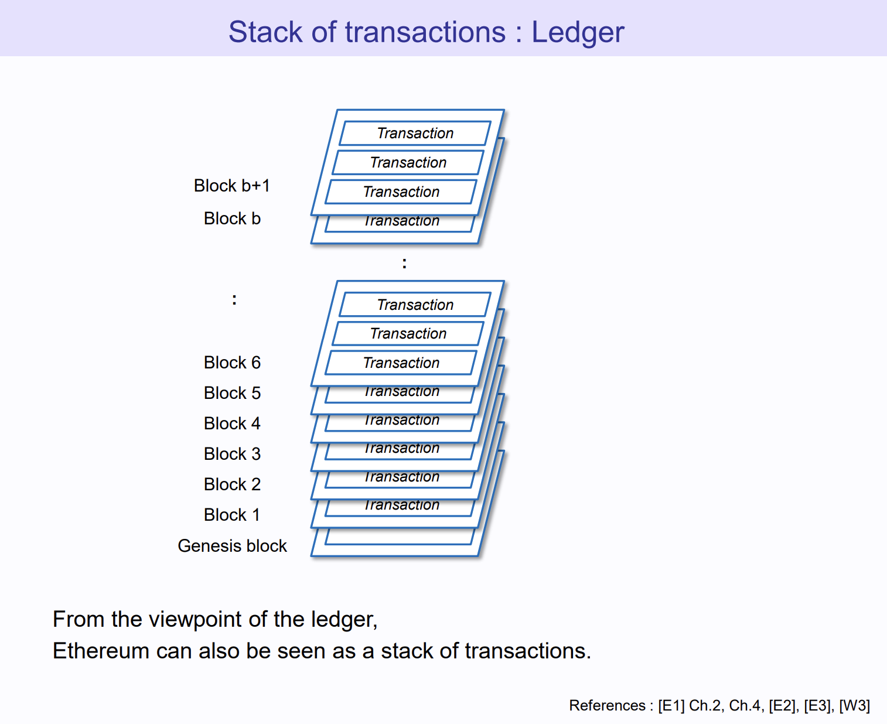

## Lets build!

---
---

# But I don't know Solidity!

- Basics isn't that hard (mastering it is hard)

 

- Build on others' protocol
- Templates & Libraries
- Work with smart contract dev / AI

---
layout: center
---

the actual bigger problem:
 
What to build?

---
---

# What's "dApp"?
- De-Fi?
- Identity?
- on-chain data & activities?
- on top of some protocol?

## Examples

- [Uniswap](https://app.uniswap.org/)

- [Polymarket](https://polymarket.com/)

- [Fileverse](https://fileverse.io/)

<!-- We are going to Dissect -->

---
layout: center
---

## But why dApp?

---
layout: center
---

## Firstly, why blockchain...

---
---

# Why Blockchain

- Double spending problem
  - Imagine you're buying     od from different stores with a offline phone..
  - OK We have entralized banks or VISA/Master...
  - Ok We don't trust them. Lets decentralize

---
layout: two-cols
---

# Blockchain (since 1982)
## 

::right::

## 

 
 

- BTC = UTXO
- ETH = Account Model

##### [📖Read More - Alchemy](https://docs.alchemy.com/docs/utxo-vs-account-models#:~:text=Ethereum's%20account%2Dbased%20transactions%20must,simple%20and%20stateless%20as%20possible.)

---
layout: center
---

## a decentralized, secure, programmable one?

---
layout: center
---

# Blockchain .. as in distributed systems

#### notes from my uni days (2010...literally Before.ETH.)

- Never truly absolute global time across systems

- since 70s - study orders of events happening across systems

---
layout: two-cols
---

## Byzantine Generals Problem (DYOR)

- inaccurate time, failures, dishonest actors etc...

 

::right::

 
 
 

 But we're not living in Eastern Roman Empire 

<!-- More - [Byzantine Generals Problem](https://medium.com/@ayogun/byzantine-generals-problem-a47b33ef87fc) -->

---
layout: two-cols
---

# Age of Empires problem

- inaccurate time, failures, dishonest actors etc...

::right::

FoW (Fog of war)...
 
- Is my alliance trustworthy?
- When should you attack?

---
---

## "Byzantine Fault Tolerance"

- [algorithms like pBFT - since 90s](https://www.geeksforgeeks.org/practical-byzantine-fault-tolerancepbft/)

- not blockchain specific

- "Reach Concensus"

---
layout: center
---

Both challenge & values of a decentralized blockchain

---
layout: two-cols
---

### Blockchain removes FoW
### adds new ways for coordinations 

## 

- transparent, common world state
- trustless mechanisms
- incentivized actors

::right::

 
 
 

---
---

# in Ethereum we trust

 

---
layout: center
---

Enabling new game theoretic mechanisms

---
---

## Vitalik's version

---
layout: center
---

Let's put everything on-chain...
Huh?

<!-- 

# We will be fully on-chain...
- e.g. "on-chain game"

- Why farcaster
- polymarket -->

---
layout: center
---

~~Let's put everything on-chain...~~
 
What make sense to be on chain?

---
layout: two-cols
---

# Digital Asset

### NFT
- on-chain token (ERC721/1155)
- image usually on IPFS
  - immutable
- censorship resistant

::right::

---
layout: two-cols
---

# Trustless

### Polymarket as an example
- on-chain prediction market

 

::right::

I trust...
- no one can take away the $ (self-custodial)
- always payout ([Gnosis Conditional Token](https://docs.gnosis.io/conditionaltokens/) design ensure liquidity)
- honest outcome (enforced by smart contract/oracle)
- censorship resistant (everyone can participate)

~~if:~~
- ~~smart contract don't get hacked~~
- ~~smart accounts don;t get locked~~
- ~~fair resolution at UMA oracle~~

---
---

# Back to the Why dApp Q
- Liquidity & Community
- Ecosystems
- New games (mechanisms)

 

#### Your call to mix and match
- look at farcaster (decentralized social)
  - not everything "on-chain", separted gossip protocols
- Does a on-chain duolingo make sense?

---
---

<!-- - change trust assumptions
- trustless, transparent 
- enough liqudity -->

<!-- 
- polymarket / trustless
- nft / immutable / ownership  
- autonomous world / agent params and action space
- censorship resistant / tornado cash / someone stop you transfer a to b 
Ofac
- mirror / publishing vs facebook -->

<!--  -->

# OK Now we solved existential crisis

## Time to fall in love with Ethereum!

---
layout: two-cols
---

# Lets talk abt something simple

### Swapping on Uniswap...

1. Connect
2. Select on UI
2. (Approve ERC20 allowance)
3. Sign Transaction!
4. Done, Easy! ignoring how AMM works

::right::

---
layout: center
---

"Connecting wallet" - Wait how my wallet works?

---
layout: two-cols
---

### Recap: Your account lives on the chain

<!-- - EOA
  - external as in blockchain do not run code in it -->

- you signs transactions for it!

---
---

### You signs txn for it!

---
---

## Basics of Private/Public Key (DYOR)
- Assume you know enough about assymetric encryption / cold wallets
-  [HD Wallets](https://www.ledger.com/academy/crypto/what-are-hierarchical-deterministic-hd-wallets)
- Deep Dive
  - [Understanding Cryptography](https://link.springer.com/book/10.1007/978-3-642-04101-3)
  - [Read World Cryptography](https://www.manning.com/books/real-world-cryptography)
<!--   -->

---
layout: two-cols
---

## "Wallet"
 
Case of Metamask Browser extension
 

- both wallet UI & key storage
- works with cold wallet too!

::right::

---
---

## Wallets. Wallets everywhere 

---
---

## TSS & SSS
-  Threshold Signature Scheme
  - update 
---
---
## SCW
- account abstraction 
- change the flow

<!--  -->

## SSS
- Matheamtical intutiion

---
layout: center
---
Swapping on Uniswap...
  Wait. How the dApp talk to the blockchain?

---
layout: center
---
APIs!
 
specifically, JSON-RPC
 
stateless, light-weight remote procedure call (RPC) protocol

---
---
## What happens with a txn

Simplified
 

---
---

<!-- rpc -->
<!--  -->

# in your browser: window.ethereum 

- On [Uniswap](https://app.uniswap.org/) with metamask
    - Try in Dev Console "window.ethereum"
    - On incognito?
    - Before & after unlocking metamask?

- [EIP-1193](https://eips.ethereum.org/EIPS/eip-1193)

- Metamask injected the window.ethereum provider

- Try running the sample code in the spec, e.g.

<code>
ethereum
  .request({ method: 'eth_accounts' })

</code>

---
---

# What happens under the hood

---
---

<!--  -->

# 2 practical types of txn

## Limitations of EOA

### Real world metaphor

Buying a coffee
- Passing your coffee loyalty card to your friend.. OK 
- Passing your whole wallet with all your ATM password.. wait

---
---

---

## Fiat equivalents
- Joint account with spouse (Not financial advice)
- CFO with Company governance / Board of directors 

## Crypto equivalent 
  - Multisig 
  - MPC

---
---

Core intuition is easy

Only with enough points, uniquely determine the curve

### Multisig vs TSS vs MPC
- cost, privacy concern
  - multisig = on-chain 
- upgradability 
  - smart contract upgrade  

## Transactions

## EVM / solidity

## Gas

https://x.com/VitalikButerin/status/1819146290271490403

---
---

I want my team to have control..

Navie way

Split password

- not the most secure ways for some obvious reason 
Unfortunately I hv seen that in prod

## Connect vs Sign

- Web2: Login button

- Web3: 
  - Connect: RPC connection. Client shows on-chain wallet  
  - Login: (Sign-in With Ethereum) SIWE. Signatures sent to server

Wallet Connect provider

https://docs.walletconnect.com/advanced/providers/ethereum

# 
Custodial vs non custodial 
Semi custodial 
Gaming Sequence

---

---
---