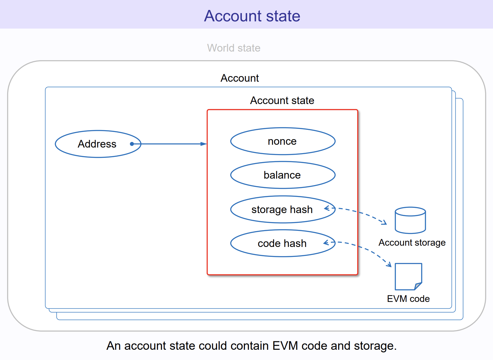

# What's "dApp"?
- De-Fi?
- Identity?
- on-chain data & activities?
- on top of some protocol?

## Examples

- [Uniswap](https://app.uniswap.org/)

- [Polymarket](https://polymarket.com/)

- [Fileverse](https://fileverse.io/)

We are going to Dissect

---
---

# I don't know Solidity!

- Build on others' protocol
- Templates & Libraries
- Work with smart contract dev / AI

---
---

# Why Blockchain

- Double spending problem
  - Imagine you're buying food from different stores with a offline phone..
  - OK We have entralized banks or VISA/Master

- But we want a decentralized version? 

---
---

## Blockchain.. as a distributed systems

### Consencus matters

- BTC = UTXO 
- Ethereum = Account Model

## NFT
- image
- stored in IPFS
- immutable 
- censorship resistence

---
---

---
---

<!-- "On my disconnected smartphone, I still have $50" -->

---
---

## What is Txn

## Notes distributed systems since 1970s...

- Never truly absolute global time across systems

- in 70s - study orders of events happening across systems

- literally before Ethereum

## Byzantine Generals Problem (DYOR)

- inaccurate time
- subject to failures

More - [Byzantine Generals Problem](https://medium.com/@ayogun/byzantine-generals-problem-a47b33ef87fc)

---
---
Why on chain

- polymarket / trustless
- nft / immutable / ownership  
- autonomous world / agent params and action space
- censorship resistant / tornado cash / someone stop you transfer a to b 
Ofac
- mirror / publishing vs facebook

Polymarket prediction market
- change trust assumptions
- trustless, transparent 
- enough liqudity

Part1a
Now we solve existential crisis
Fall in love with eth 
What happens under the hood

---
layout: two-cols
---

## Blockchain removes the FOG
- enable Trust
- incentivize actors
- common world state

::right::

### Game-changing technology

- enable new game theoretic mechanisms

---
---

## Vitalik's version

<!--  -->

## Limitations of EOA

### Real world metaphor

Buying a coffee
- Passing your coffee loyalty card to your friend.. OK 
- Passing your whole wallet with all your ATM password.. wait

---
---

# We will be fully on-chain...
- e.g. "on-chain game"

- Why farcaster
- Does a on-chain duolingo make sense?

- More than de-fi
- polymarket

---

## Fiat equivalents
- Joint account with spouse (Not financial advice)
- CFO with Company governance / Board of directors 

## Crypto equivalent 
  - Multisig 
  - MPC

## TSS & SSS
-  Threshold Signature Scheme
  - update 

## SSS
- Matheamtical intutiion

Core intuition is easy

Only with enough points, uniquely determine the curve

### Multisig vs TSS vs MPC
- cost, privacy concern
  - multisig = on-chain 
- upgradability 
  - smart contract upgrade  

## Transactions

## EVM / solidity

## Gas

https://x.com/VitalikButerin/status/1819146290271490403

---
---

I want my team to have control..

Navie way

Split password

- not the most secure ways for some obvious reason 
Unfortunately I hv seen that in prod

## How does your dApp talk to blockchain?
- Metamask as an example
- network configurations

## Connect vs Sign

Wallet Connect provider

https://docs.walletconnect.com/advanced/providers/ethereum

# 
Custodial vs non custodial 
Semi custodial 
Gaming Sequence

# 2 practical types of txn

---

## Back to the Why dApp Q
- Liquidity & Community
- Ecosystems
- New games