---
# You can also start simply with 'default'
theme: seriph
# random image from a curated Unsplash collection by Anthony
# like them? see https://unsplash.com/collections/94734566/slidev
background: https://cover.sli.dev
# some information about your slides (markdown enabled)
title: W3DevC - Intro to ETH Workshop 
info: |
  ## Slidev Starter Template
  Presentation slides for developers.

  Learn more at [Sli.dev](https://sli.dev)
# apply unocss classes to the current slide
class: text-center
# https://sli.dev/custom/highlighters.html
highlighter: shiki
# https://sli.dev/guide/drawing
drawings:
  persist: false
# slide transition: https://sli.dev/guide/animations#slide-transitions
transition: slide-left
# enable MDC Syntax: https://sli.dev/guide/syntax#mdc-syntax
mdc: true
---

# W3DC - Intro to ETH Workshop 

Meetup of Technical audience around Eth ecosystems during Token2049 


<div class="abs-br m-6 flex gap-2">
  <button @click="$slidev.nav.openInEditor()" title="Open in Editor" class="text-xl slidev-icon-btn opacity-50 !border-none !hover:text-white">
    <carbon:edit />
  </button>
  <a href="https://github.com/slidevjs/slidev" target="_blank" alt="GitHub" title="Open in GitHub"
    class="text-xl slidev-icon-btn opacity-50 !border-none !hover:text-white">
    <carbon-logo-github />
  </a>
</div>

<!--
The last comment block of each slide will be treated as slide notes. It will be visible and editable in Presenter Mode along with the slide. [Read more in the docs](https://sli.dev/guide/syntax.html#notes)
-->

---
transition: fade-out
---

# Who is this for

<br>

This workshop is for developers who want to get started with Web3 dApp development on Ethereuem ecosystems. 

Most importantly, you plan to get your hands dirty, perhaps by participating a hackathon like [ETHGlobalSG](https://ethglobal.com/events/singapore2024) in Sep.   

You're likely either

- 🧑‍💻 **Experienced Web2 Developers** - Developer by trade but you have never build on Web3 in production
- 🙆 **Crypto users** - You're native in web3, somewhat technical and trying to learn how things are built 
- 🚀 **Technical Product People** - You don't code much at work but went through basic programming bootcamps, keen to understand more on web3 devs 


<!--
You can have `style` tag in markdown to override the style for the current page.
Learn more: https://sli.dev/guide/syntax#embedded-styles
-->

<style>
h1 {
  background-color: #2B90B6;
  background-image: linear-gradient(45deg, #4EC5D4 10%, #146b8c 20%);
  background-size: 100%;
  -webkit-background-clip: text;
  -moz-background-clip: text;
  -webkit-text-fill-color: transparent;
  -moz-text-fill-color: transparent;
}
</style>

<!--
Here is another comment.
-->

---
level: 2
---

# Hows this workshop different - Goal

<br />

We know. There are numerous resources online that you can just speedrun.

This in-person workshop try to help you to
- gain momentum, know where to start given your background
- identify key fundamentals and trends
- ask questions to senior industry particioners
- find you hackathon teammates perhaps


---

# Hows this workshop different - Format

<br/>

We think a [Flipped classroom](https://en.wikipedia.org/wiki/Flipped_classroom) make sense.
- We will send out reading list and leading questions before the workshop.
- Workshop will prioritize showcase and Q&A to guide your future curriculum
- ideally we will see each other during the hackathon

It will be a after-work 4*30mins sessions with food.

To get most out of it, you would have to spend a few hours on the reading lists, tried to follow a few tutorials, have a brief project idea in mind and prepare for questions!

---


# Guiding Questions


Hopefully you will have better ideas on some of the below questions to continue your dev journey
- When do we want smart contracts for a project?
- What are censorship resistence, provenance, immutability? 
- How do I test against my dapp, without using real $ (Env & Testnets setup)
- How's different to build apps on "L1 vs L2"? 
- What are some notable dApps and how are they being built?
- How can I deploy a smart contract?
- How to improve transactions confirmations UX in Ethereum?
- What are some hackathon projects that are pushing boundaries?

---
---

# What will NOT be covered
- Protocol knowledge except the essential, such as fault proofs, MEV, ZKEVM etc. We recommend materials from https://epf.wiki/
- Particular techstack (of hackathon sponsors). Check ETHGlobal youtube channel for corredsponding quick intro.
- How to launch a token


---
---

# Agenda - 1.0 Draft
30min session on "What is a dAPP"
- Dissecting dApp interactions on [Polymarket](https://polymarket.com/)
- Dissecting a simple, past hackathong project such as [Vincent's past project](https://ethglobal.com/showcase/delegative-wwptp)

- Why smart contract?
- Why NFT?
- What Ethereum/Blockchain helps to guarantee?
- What is censorship resistence?
- What is transaciton? 
- What are some frequently talk about primiative such as hash, signatures, attetations?

---
---

# Agenda - 2.0 Draft
30min session to talk about typical dApp frontend
- wagmi / rainbowkit setup
- Checksummed address
- ENS
- Scaffold ETH
- How to use a blockchain explorer
- Try a transaction on testnet
- What is a Oracle?

---
---

# Agenda - 3.0 Solidity
30min sesion to show and tell how smart contracts are being built.
Will not cover details of types, gas optimization tips
- Remix
- Setup a local environment with hardhar/foundry
- What is upgradeable contract?
- Openzepplins  
- testnet faucets
- moonshot: understand how to deploy a basic ERC20 staking contract with vesting

---
---

# Agenda - 4.0 Draft
- 10-20min on networking / teammates matching
- 10min on hackathon tips
- Q&A session
- Open mic to talk about potential hackathon project ideas


---
---

# Reading List

#### Core Reads
- [ScaffoldETH](https://scaffoldeth.io/)
- [Scaffold ETH 🛠️ Building dApps Quickly](https://www.youtube.com/watch?v=Cg4uL6lnf-s)
- What is [Ethereum Name Service](https://docs.ens.domains/learn/protocol)
- [Protocol Foundations 001: Cryptography](https://summerofprotocols.com/wp-content/uploads/2023/12/53-BEIKO-001-2023-12-13.pdf)
- [Ethereum in 30 minutes by Vitalik Buterin](https://www.youtube.com/watch?v=UihMqcj-cqc)
- WIP


#### Recommended Reads

- [Vitalik Buterin | Ethereum's Past, Present, Future & Thoughts on Türkiye](https://www.youtube.com/watch?v=MWaNej58Wn0)
  - Vitalik talked about UX problems, Client centralizations, L2 fragmentations, Sharding etc in the video, helpful to get a glance at how the ecosystems is evolving
- [Protocol Wiki](https://epf.wiki/)
- WIP


---
---
# Date & Venue 


- 5th Sep 2024 (Wed)
- AWS (TBC)


- *Subject to venue/speaker availabiliy


---

---

# Organizers

- Web3Dev.Community
We have hosted 5+ develoepr meetups in Singapore with speakers from Filecoin, Coinbase, Chainlink, LiquidX and more web3 companies.


<!--  -->


### Community Partners

- [Talent@Web3](https://talentweb3.co/)


- ETHGlobal (TBC)
 - [Perks applying hackathon via W3DC](https://docs.google.com/forms/d/1ap40lW7jSZRIKIaFt_Zglt9Ap4DnaxDGlqUbqi_fYuY/edit) 


--
--

## Speaker introduction (TODO)

Vincent
- https://www.linkedin.com/in/vincentlaucy/


Aaron
- https://www.linkedin.com/in/aaronstevensonlee

---
---

---

## Part 1

- tooling including remix and hardhat, primer to forge
- local hardhat node
- faucet and getting sepolia eth
- developing a basic erc20 with open zeppelin and staking contract with vesting (might be too much)


---


---

# Components

<div grid="~ cols-2 gap-4">
<div>

You can use Vue components directly inside your slides.

We have provided a few built-in components like `<Tweet/>` and `<Youtube/>` that you can use directly. And adding your custom components is also super easy.

```html
<Counter :count="10" />
```

<!-- ./components/Counter.vue -->
<Counter :count="10" m="t-4" />

Check out [the guides](https://sli.dev/builtin/components.html) for more.

</div>
<div>

```html
<Tweet id="1390115482657726468" />
```

<Tweet id="1390115482657726468" scale="0.65" />

</div>
</div>

<!--
Presenter note with **bold**, *italic*, and ~~striked~~ text.

Also, HTML elements are valid:
<div class="flex w-full">
  <span style="flex-grow: 1;">Left content</span>
  <span>Right content</span>
</div>
-->

---
class: px-20
---

# Themes

Slidev comes with powerful theming support. Themes can provide styles, layouts, components, or even configurations for tools. Switching between themes by just **one edit** in your frontmatter:

<div grid="~ cols-2 gap-2" m="t-2">

```yaml
---
theme: default
---
```

```yaml
---
theme: seriph
---
```


</div>

Read more about [How to use a theme](https://sli.dev/themes/use.html) and
check out the [Awesome Themes Gallery](https://sli.dev/themes/gallery.html).

---

# Clicks Animations

You can add `v-click` to elements to add a click animation.

<div v-click>

This shows up when you click the slide:

```html
<div v-click>This shows up when you click the slide.</div>
```

</div>

<br>

<v-click>

The <span v-mark.red="3"><code>v-mark</code> directive</span>
also allows you to add
<span v-mark.circle.orange="4">inline marks</span>
, powered by [Rough Notation](https://roughnotation.com/):

```html
<span v-mark.underline.orange>inline markers</span>
```

</v-click>

<div mt-20 v-click>

[Learn More](https://sli.dev/guide/animations#click-animations)

</div>

---

# Motions

Motion animations are powered by [@vueuse/motion](https://motion.vueuse.org/), triggered by `v-motion` directive.

```html
<div
  v-motion
  :initial="{ x: -80 }"
  :enter="{ x: 0 }"
  :click-3="{ x: 80 }"
  :leave="{ x: 1000 }"
>
  Slidev
</div>
```

<div class="w-60 relative">
  <div class="relative w-40 h-40">
    
    
    
  </div>

  <div
    class="text-5xl absolute top-14 left-40 text-[#2B90B6] -z-1"
    v-motion
    :initial="{ x: -80, opacity: 0}"
    :enter="{ x: 0, opacity: 1, transition: { delay: 2000, duration: 1000 } }">
    Slidev
  </div>
</div>

<!-- vue script setup scripts can be directly used in markdown, and will only affects current page -->
<script setup lang="ts">
const final = {
  x: 0,
  y: 0,
  rotate: 0,
  scale: 1,
  transition: {
    type: 'spring',
    damping: 10,
    stiffness: 20,
    mass: 2
  }
}
</script>

<div
  v-motion
  :initial="{ x:35, y: 30, opacity: 0}"
  :enter="{ y: 0, opacity: 1, transition: { delay: 3500 } }">

[Learn More](https://sli.dev/guide/animations.html#motion)

</div>

---

# LaTeX

LaTeX is supported out-of-box. Powered by [KaTeX](https://katex.org/).

<div h-3 />

Inline $\sqrt{3x-1}+(1+x)^2$

Block
$$ {1|3|all}
\begin{aligned}
\nabla \cdot \vec{E} &= \frac{\rho}{\varepsilon_0} \\
\nabla \cdot \vec{B} &= 0 \\
\nabla \times \vec{E} &= -\frac{\partial\vec{B}}{\partial t} \\
\nabla \times \vec{B} &= \mu_0\vec{J} + \mu_0\varepsilon_0\frac{\partial\vec{E}}{\partial t}
\end{aligned}
$$

[Learn more](https://sli.dev/guide/syntax#latex)

---

# Diagrams

You can create diagrams / graphs from textual descriptions, directly in your Markdown.

```mermaid
mindmap
  root((mindmap))
    Origins
      Long history
      ::icon(fa fa-book)
      Popularisation
        British popular psychology author Tony Buzan
    Research
      On effectiveness<br/>and features
      On Automatic creation
        Uses
            Creative techniques
            Strategic planning
            Argument mapping
    Tools
      Pen and paper
      Mermaid
```

<div class="grid grid-cols-4 gap-5 pt-4 -mb-6">





</div>

[Learn More](https://sli.dev/guide/syntax.html#diagrams)

---
foo: bar
dragPos:
  square: 691,32,167,_,-16
---

# Draggable Elements

Double-click on the draggable elements to edit their positions.

<br>

###### Directive Usage

```md

```

<br>

###### Component Usage

```md
<v-drag text-3xl>
  <carbon:arrow-up />
  Use the `v-drag` component to have a draggable container!
</v-drag>
```

<v-drag pos="663,206,261,_,-15">
  <div text-center text-3xl border border-main rounded>
    Double-click me!
  </div>
</v-drag>


###### Draggable Arrow

```md
<v-drag-arrow two-way />
```

<v-drag-arrow pos="67,452,253,46" two-way op70 />

---
src: ./pages/multiple-entries.md
hide: false
---

---

# Monaco Editor

Slidev provides built-in Monaco Editor support.

Add `{monaco}` to the code block to turn it into an editor:

```ts {monaco}
import { ref } from 'vue'
import { emptyArray } from './external'

const arr = ref(emptyArray(10))
```

Use `{monaco-run}` to create an editor that can execute the code directly in the slide:

```ts {monaco-run}
import { version } from 'vue'
import { emptyArray, sayHello } from './external'

sayHello()
console.log(`vue ${version}`)
console.log(emptyArray<number>(10).reduce(fib => [...fib, fib.at(-1)! + fib.at(-2)!], [1, 1]))
```

---
layout: center
class: text-center
---

# Learn More

[Documentation](https://sli.dev) · [GitHub](https://github.com/slidevjs/slidev) · [Showcases](https://sli.dev/showcases.html)

<PoweredBySlidev mt-10 />
