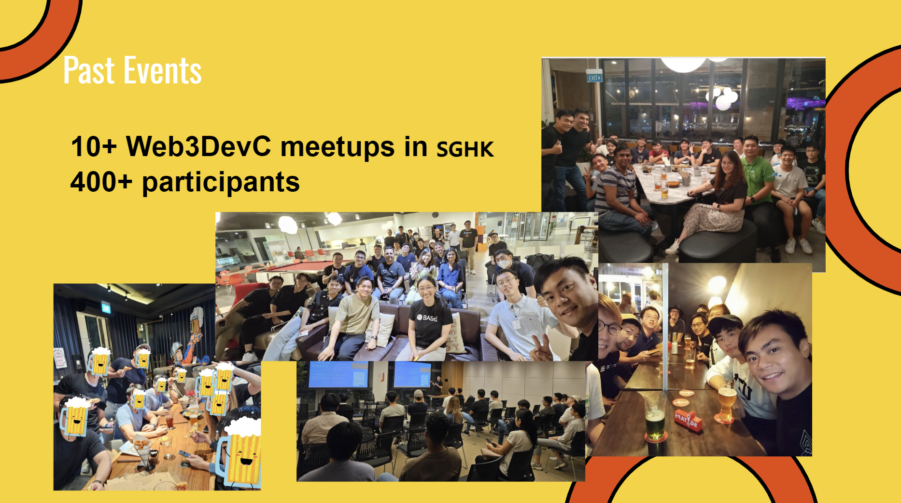
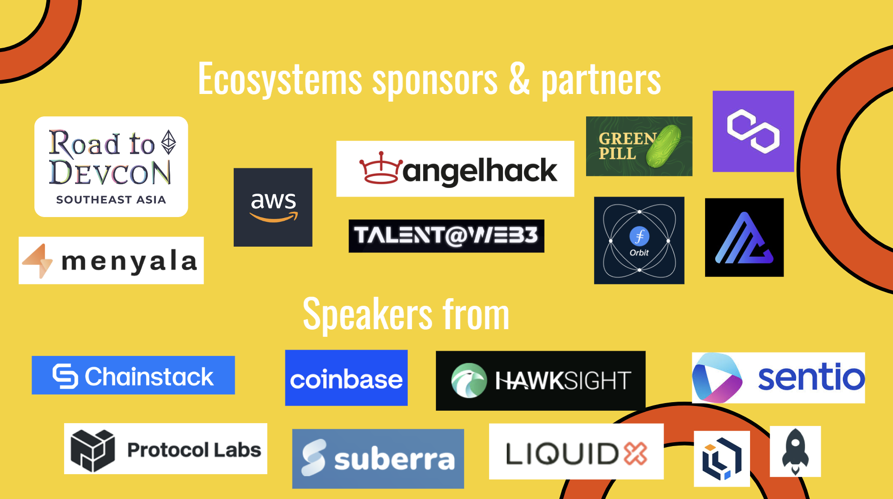
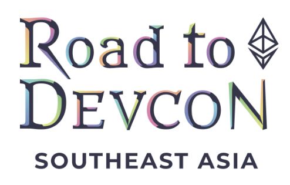
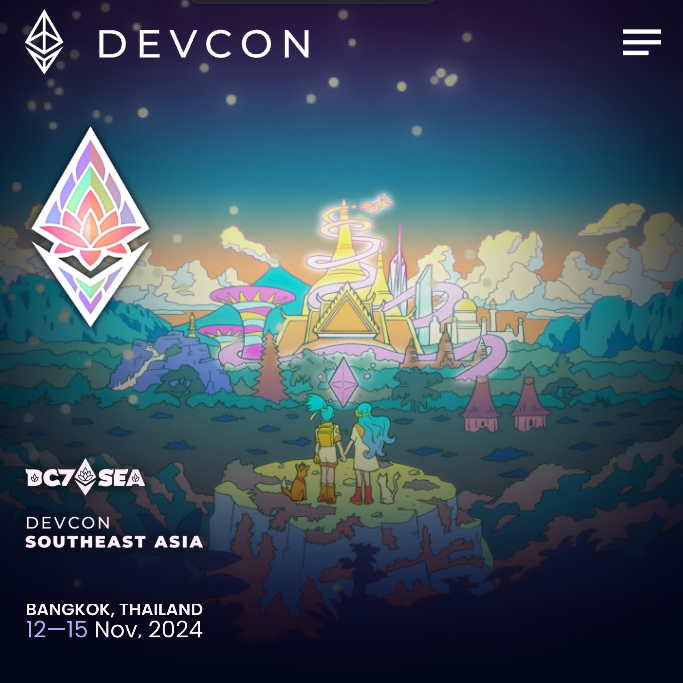

---
# You can also start simply with 'default'
theme: seriph
# random image from a curated Unsplash collection by Anthony
# like them? see https://unsplash.com/collections/94734566/slidev
# background: https://cover.sli.dev
# some information about your slides (markdown enabled)
title: W3DevC - Build on ETH Intro Workshop
info: |
 ## Workshop by https://web3dev.community/
# apply unocss classes to the current slide
class: text-center
# https://sli.dev/custom/highlighters.html
highlighter: shiki
# https://sli.dev/guide/drawing
drawings:
  persist: false
# slide transition: https://sli.dev/guide/animations#slide-transitions
transition: slide-left
# enable MDC Syntax: https://sli.dev/guide/syntax#mdc-syntax
mdc: true
layout: image
image: w3dc_sep4.png

backgroundSize: contain
---

<!-- W3DC - Build on ETH Intro Workshop -->

<!-- In-person dev workshop in Singapore before ETHGlobalSG hackathon -->

<!--
The last comment block of each slide will be treated as slide notes. It will be visible and editable in Presenter Mode along with the slide. [Read more in the docs](https://sli.dev/guide/syntax.html#notes)
-->

---
transition: fade-out
---

## Intro to Web3Dev.Community

---
---

## 

---
layout: two-cols
---

# Thanks Road to DEVCON
- Workshop sponsored by [Ethereum Foundation RTD Grant](https://devcon.org/en/road-to-devcon/)

- Largest Ethereum conference for developers, in SEA this year!
- We're giving out discounted tickets ($49)

::right::

---
---

## Where to found this slides & TG group

  

# https://web3dev.community/

---
transition: fade-out
---

# Who is this for

 

This workshop is for developers who want to get started with Web3 dApp development on Ethereuem ecosystems. 

Most importantly, you plan to get your hands dirty, perhaps by participating a hackathon like [ETHGlobalSG](https://ethglobal.com/events/singapore2024) in Sep.   

You're likely either

- 🧑‍💻 **Experienced Web2 Developers** - Developer by trade but you have never build on Web3 in production
- 🙆 **Crypto users** - You're native in web3, somewhat technical and trying to learn how things are built 
- 🚀 **Technical Product People** - You don't code much at work but went through basic programming bootcamps, keen to understand more on web3 devs 

---
---

# Why workshop

- Quickly changing space
   - going to a crypto conference...
     - ZK! FHE! Intent arch! Pre-confirmations!     
   - "X is great and lets use X to solve your crypto problem"
     - solution looking for problems

- Things are sometimes easier from a Dev / CS angle

---
level: 2
---

# Hows this workshop different - Goal

 

We know. There are numerous resources online that you can just speedrun.

This in-person workshop try to help you to
- gain momentum, know where to start given your background
- identify key fundamentals and trends
- ask questions to senior industry particioners
- find you hackathon teammates perhaps

---

# Hows this workshop different - Format

 

We think a [Flipped classroom](https://en.wikipedia.org/wiki/Flipped_classroom) make sense.
- We will send out reading list and leading questions before the workshop.
- Workshop will prioritize showcase and Q&A to guide your future curriculum
- ideally we will see each other during the hackathon

It will be a after-work 3*30mins sessions with food.

To get most out of it, you would have to spend a few hours on the reading lists, tried to follow a few tutorials, have a brief project idea in mind and prepare for questions!

---

# Guiding Questions

Hopefully you will have better ideas on some of the below questions to continue your dev journey
- What are censorship resistance, provenance, immutability? 
- How do I deploy a contract, test against my dApp, without using real $ (Env & Testnets setup)?
- How's it different to build apps on "L1 vs L2"? 
- What are some notable dApps and how are they being built? Why Smart contract?
- What are EOA, Smart accounts, Multi-sig, MPC wallets? 
- How to improve transactions confirmations UX in Ethereum?
- What are ERC721, 1155, 6551...which EIPs are must-read?
- What are some creative or state-of-art example hackathon projects?

---
---

# What will NOT be covered
- Protocol knowledge except the essential, such as fault proofs, MEV, ZKEVM etc. We recommend materials from https://epf.wiki/
- Particular techstack (of hackathon sponsors). Check ETHGlobal youtube channel for corredsponding quick intro.
- How to launch a token

---
layout: two-cols
---

# Speaker introduction 

### @Vincent | [@debuggingfuture](https://x.com/debuggingfuture) | [Linkedin](https://www.linkedin.com/in/vincentlaucy/)

- Organizer of Web3Dev.Community
- Founder@Fractal Labs
  - Dev studio focusing AI-powered on-chain agents and CMS workflows
- 12yr+ Founder/Tech Lead roles
  - Animoca, Pixelmon (Web3 VC/Game Studio), 5+ startups in EdTech, FinTech, Localization
- Msc CS, Msc Maths (WIP) - thus keen on the science  
- 2x ETHGlobal Finalist with $25k+ prize

::right::

# 

### @Aaron | [Linkedin](https://www.linkedin.com/in/aaronstevensonlee)
- Engineering Manager and Dev Lead at Web3 VC, built staking protocols with millions+ TVL
- 12yr+ Tech Lead roles at govTech & various startups

---
---

# Agenda
- 1845: Open floor & Networking
- 1900-1910: Intro & Housekeeping
- 1910-1930: #1 Whats dApp? Key concepts on ETH  
- 1930-1945: Break out session - where should I start?
- 1945-2010: #2 Typical dApp Frontend techstack
- 2010-2020: Bonus - Blinklab Demo 
- 2020-2050: #3 Solidity Intro
- 2050-2100: Outro - Starting a project / Hackathon Tips
- 2100: 📷! Networking🍷! Q&A & hackathon project ideas 

---
---
<!-- 
# Agenda - Part1 Draft
30min session on #1 Whats dApp? Key concepts on ETH  
- Why smart contract?
- Why NFT?
- What Ethereum/Blockchain helps to guarantee?
- What is IPFS and why? 
  - immutability, censorship resistence, security
- What are some buzzwords you hear often and you want to learn more?

- What is a transaciton? 
- What are some frequently talk about primiative such as hash, signatures, attetations?
- What is EOA vs smart account?
- Intuition / Application of Shamir secret sharing, MPC vs Multi-sig -->
---
---

---
src: part1.md
---

---
---
## Break out session
Questions
- Instructor's journey
- What's background/journey? 
- why are you here (learning Web3)?
- What do you want to build/work at? 
- Curriculum/Materials recommendations
- What's X & Is X hard to learn?

---
src: part2.md
---

---

# Agenda - Part2 Draft

30min session to talk about typical dApp frontend
- wagmi / rainbowkit setup
- Checksummed address
- ENS
- Scaffold ETH
- How to use a blockchain explorer
- Try a transaction on testnet
- What is a Oracle?

---
---

## Journey of a transaction

Vincent swap 0.02 ETH with Uniswap

## "Connecting wallet" - Wait where is my key?
- metamask
- case of cold wallet / ledger
- metamask could be UI or also the wallet 

Metamask architecture
- https://docs.metamask.io/wallet/concepts/architecture/

## What hapepns
https://www.reddit.com/r/ethereum/comments/10ug7cs/i_made_a_little_visual_aid_of_what_happens_when/

# Agenda - Bonus 

- Demo from blinklabs.ai

---

## Wagmi

---
---

# Agenda - Part3 Solidity
30min sesion to show and tell how smart contracts are being built.
Will not cover details of types, gas optimization tips
- Remix
- Setup a local environment with hardhar/foundry
- What is upgradeable contract?
- Openzepplins  
- testnet faucets
- moonshot: understand how to deploy a basic ERC20 staking contract with vesting

---
---

# Agenda - Part4 Draft
- Notable hackathon projects
- 10min on hackathon tips
- Q&A session
- Open mic to talk about potential hackathon project ideas
- 10-20min on networking / teammates matching

## Build
- Richard Feynman
 what I cannot create I do not understand

Thank you! See you at hackathon

---
---

# Reading List

#### Core Reads
- [ScaffoldETH](https://scaffoldeth.io/)
- [Scaffold ETH 🛠️ Building dApps Quickly](https://www.youtube.com/watch?v=Cg4uL6lnf-s)
- What is [Ethereum Name Service](https://docs.ens.domains/learn/protocol)
- [Protocol Foundations 001: Cryptography](https://summerofprotocols.com/wp-content/uploads/2023/12/53-BEIKO-001-2023-12-13.pdf)
- [Ethereum in 30 minutes by Vitalik Buterin](https://www.youtube.com/watch?v=UihMqcj-cqc) [Slides](https://hackmd.io/@vbuterin/ethereum_in_30_minutes)
- [How IPFS works](https://docs.ipfs.tech/concepts/how-ipfs-works/)
- [Ethereum Illustrated](https://takenobu-hs.github.io/downloads/ethereum_evm_illustrated.pdf) 

Reading List #2

## What kind of accounts and wallets are there?
- Read EOA vs Contract Account https://ethereum.org/en/developers/docs/accounts/
- what's "self-custodial"   https://learn.metamask.io/lessons/what-is-a-self-custody-wallet
- What are Multsig & MPC? https://www.fireblocks.com/blog/mpc-vs-multi-sig/

## How Ethereum Transaction works
- Overview  https://ethereum.org/en/developers/docs/transactions/
- What's an ABI of Smart contract https://www.alchemy.com/overviews/what-is-an-abi-of-a-smart-contract-examples-and-usage

## What is gas and Why?
Compute resource is finite - Gas mechanism helps to secure the network & avoid spam
- Pay for what you compute/store https://ethereum.org/en/developers/docs/gas/
- EVM opcode and "gas price tag" - https://www.evm.codes/

#### Recommended Reads

- [Vitalik Buterin | Ethereum's Past, Present, Future & Thoughts on Türkiye](https://www.youtube.com/watch?v=MWaNej58Wn0)
  - Vitalik talked about UX problems, Client centralizations, L2 fragmentations, Sharding etc in the video, helpful to get a glance at how the ecosystems is evolving
- [Protocol Wiki](https://epf.wiki/)
- WIP

## hackathons

Check my last talk for more

Quick Tips

1. Think about Ideas* before hand and "know your Prizes"

2. Start with working templates / POC on the tech stack before commitment

3. Submit video 2 hours earlier

<!--  -->

::right::

## Community Partners

<a href="">
  
</img></a>

- [Perks applying hackathon via WebDevCommunity](https://docs.google.com/forms/d/1ap40lW7jSZRIKIaFt_Zglt9Ap4DnaxDGlqUbqi_fYuY/edit) 

---
---

## So much EIP
- Don't start screening EIP specification
- It's [literally a PR](https://github.com/ethereum/EIPs)
- not created equal
- (historic) context matters
- very naturally run into them

- Typical ones
  - Tokens ERC20, ERC721, 1155
  - EIP-1559
  - Account abstraction EIP-4337
  - EIP-4844: Proto-Danksharding
  - ERC1967 Proxy

[https://medium.com/1kxnetwork/wallets-91c7c3457578]
(Seedless Self-Custody: On MPC and Smart Contract Wallets)

---
---
