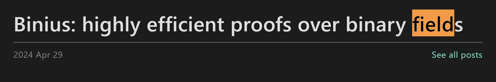

---
---

# Common dApps dev patterns and primitives by @debuggingfuture

### Disclaimers

- We position as tutors
  - so you can learn from the gigabrains!
- I'm
  - Application Developer
  - Geek who study CS/Maths
- I'm not
  - Protocol / Zk Engineer
  - Cryptographer

---
layout: center
---

# Where to Start?
- 2 Opionated Take(Rant)s

---
layout: two-cols
---

## Going to a crypto conference

- WTF is Appchain & Superchain
- WTF is FHE
- WTF is AA & ERC4337
- WTF is EIP7702
- WTF is pre-confirmations

::right::

---
layout: two-cols
---

## Learning Art history
- WTF is Baroque
- WTF is Art Deco
- WTF is Renaissance 
- WTF is Brutalism
- WTF is Modernism

::right::
<v-click>
What builders actually learn

</v-click>

---
layout: two-cols
---

## ~~Going to a crypto conference~~

- ~~WTF is Appchain & Superchain~~
- ~~WTF is FHE~~
- ~~WTF is AA & ERC4337~~
- ~~WTF is EIP7702~~
- ~~WTF is pre-confirmations~~

::right::

## What you need to know 

- Ecliptic Curve
- Modulus 
- Finite Field
- Signing signatures
- Security guarantee
<!-- metaphor: Talking SSG, SSR, ISG to devops. basic ideas not hard. Mastering them hard.  -->

---
layout: center
---
# Devcon has a track!

---
layout:center
---

# on Maths

<!-- # meme
 Not good at maths
 good at using chat gpt for maths -->

---
---
# Premier #1: Maths that sounds complicated

## Don't know WTF is `Residue class`

## But you know `modular arithmetic` already

- `5 % 3 === 2` 

<!-- Spent 15 years of our lives learn about it and finally learn to fear and avoid it -->

---
layout: two-cols
---

## Don't know WTF is group theory / rings

### But you know what is Set

---
---

## You know set & Traits in programming

- Traits/Mixins `implements RealNumber`

- `divide(x: int)-> int`

::right::

---
---

### Field

---
---

### Counter Example
- Integers ℤ is NOT a field
### Examples
- Real Numbers ℝ
- Complex Number ℂ
  - specifically, it's field extension by adjoining i. ℝ(i)
  - s.t. we have a solution for i^2 =1 
- Consider field of modulus prime number ...Prime field
- which has finite elements.... Finite Field

---
class: bg-white whiteboard
---

---
---

## One Way, Trap door function   

