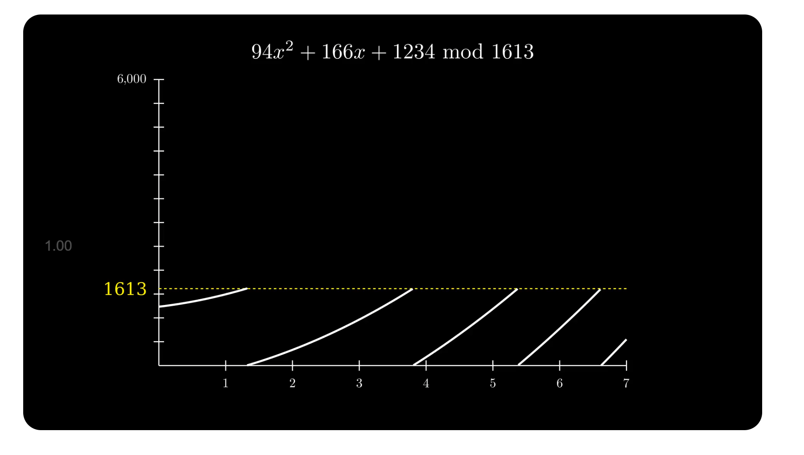
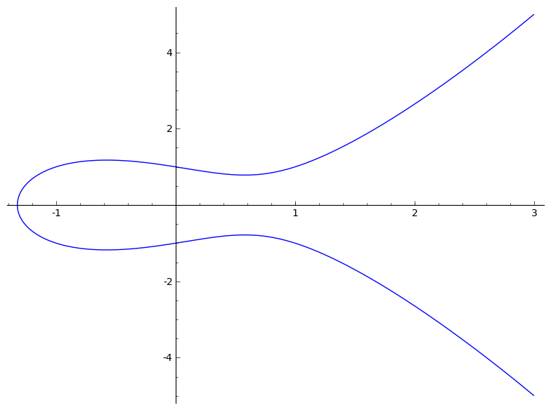
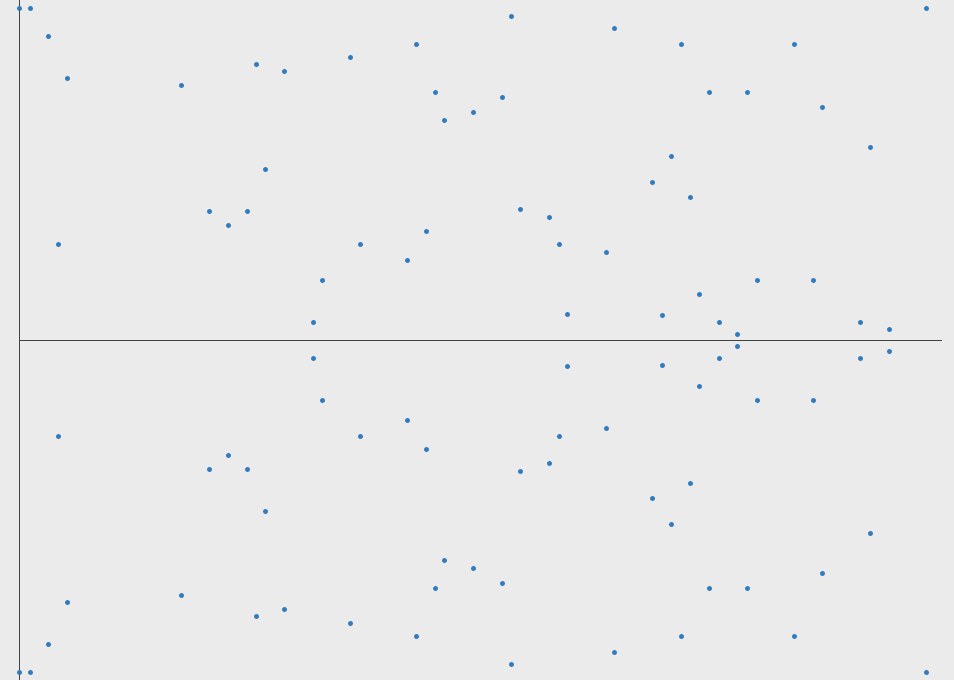
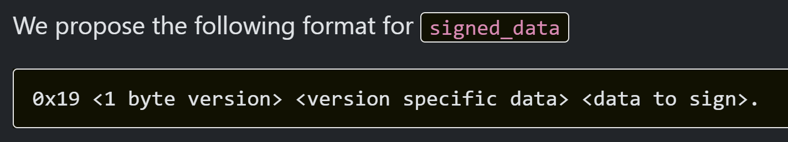

## Continue our journey on dApp

- Polymarket as an example


---
---


## Recap

- Ethereum = General purposed Blockchain
  -  a.k.a. Game-changing Technology.
  - Build Trust with World state.
- Transaction = change of state tree


<!-- TODO metamask flowchart -->

---
layout: center
---


---
layout: two-cols
---

## Step back...


- "Generate a Private key"

- "Connect Wallet"

- "Sign a transaction"

- "Sign a message to Sign in" (SIWE)

- "Sign a message for my (Smart) account to trade"

- "Sign an Attestation"

::right::

- How it happens under the hood

- Different but sharing similar building blocks


---
---

## Hash (vs Encoding) vs Encryption 

<div class="center bg-white">


</div>

[Ref: Hashing vs Encryption by Okta](https://www.okta.com/sg/identity-101/hashing-vs-encryption/)

---
---
# Hash
- Wiki: `function that map data of arbitrary size to fixed-size values`
- Examples
  - SHA256
  - keccak256 [Viem Example](https://viem.sh/docs/utilities/keccak256.html)
  - [Live Demo](https://emn178.github.io/online-tools/keccak_256.html)

```ts
import { keccak256 } from 'viem'
 
keccak256(new Uint8Array([72, 101, 108, 108, 111, 32, 87, 111, 114, 108, 100, 33])
// 0x3ea2f1d0abf3fc66cf29eebb70cbd4e7fe762ef8a09bcc06c8edf641230afec0
 
// hash utf-8 string
keccak256(toHex('hello world'))
// 0x3ea2f1d0abf3fc66cf29eebb70cbd4e7fe762ef8a09bcc06c8edf641230afec0
```

---
---

# Encoding
  - base16=hex (0-9, A-F)
  - base64 (binary-text, 64 unique characters)

```ts
window.btoa("Hello, world!")

'SGVsbG8sIHdvcmxkIQ=='

```

  - [ABI Application Binary Interface (ABI)](https://docs.soliditylang.org/en/latest/abi-spec.html)
  - Recursive-length prefix (RLP) serialization [REF](https://ethereum.org/en/developers/docs/data-structures-and-encoding/rlp/)


```ts
import { fromRlp } from 'viem'
 
fromRlp('0x850123456789', 'hex')
// "0x123456789"

fromRlp('0xc67f7f838081e8', 'hex')
// ['0x7f', '0x7f', '0x8081e8']

```

---
---

## Encryption

- e.g. RSA


- Ethereum
  - ECC


---
---

# Elliptic Curve Cryptography (ECC)

- Given P,Q on the curves, P+Q=?

- Imagine our public keys are generated on the curve
  - [secp256k1 generator](https://emn178.github.io/online-tools/ecdsa/key-generator/)
  - `Ethereum: From the Keccak-256 hash of the public key, we take the last 20 bytes (160 bits) to obtain the EOA address.`

- Elliptic curve discrete logarithm problem (ECDLP) = Hard (without private key)

---
class: bg-white center
---


---
class: bg-white
---


---
---

## Applying modulus to a polynomial

## 



<!--  -->


<!--  -->


---
layout: two-cols
---

### ECC



::right::
### Actually, on Field of modulus p




---
---
## Readings

- [A (Relatively Easy To Understand) Primer on Elliptic Curve Cryptography](https://blog.cloudflare.com/a-relatively-easy-to-understand-primer-on-elliptic-curve-cryptography/)

- Reference: 
[Mastering Ethereum, by Andreas M. Antonopoulos, Gavin Wood](https://github.com/ethereumbook/ethereumbook/blob/develop/04keys-addresses.asciidoc)


- [Reading: Everything You Wanted to Know About Wallet Keys](https://www.dynamic.xyz/blog/everything-you-wanted-to-know-about-wallet-keys)

---
layout: two-cols
---

## Q: Is that really secure?

- Someone come up with same private key (collision)?
  - extremely unlikely

<v-click>

- Deep state didn't add a backdoor?
  - [secp256k1](https://www.secg.org/sec2-v2.pdf) proposed by Certicom not NSA/NIST
  - [2013 Dual EC, Snowden confiremd they did](https://blog.cryptographyengineering.com/2015/01/14/hopefully-last-post-ill-ever-write-on/)

<br />
<blockquote>
unlike the popular NIST curves, secp256k1's constants were selected in a predictable way,
which significantly reduces the possibility that the curve's creator inserted any sort of backdoor into the curve.
</blockquote>

</v-click>

::right::

<v-click>

- Someone gain access to powerful quantum computing?
  - humans: Don't worry, won't happen overnight
  - 3bodies-aliens: Don't worry, we're F~~xx~~ed anyway

- Correct, Safe Implementation
  - e.g. [legit, auditable supplychain in javascript](https://paulmillr.com/posts/noble-secp256k1-fast-ecc/)
  - e.g. CRNG

</v-click>

---
layout: two-cols
---

# Digital Signature
- ~ Real-life signature
- provides
  - authenticity
    - e.g. When your investor ask to airdrop to wallet 0xabcde...
  - non-reputidation

- beyond signatures
  - Attestation="Someone make a statement"

::right::

<v-click>

## Elliptic Curve Digital Signature Algorithm (ECDSA) 

- use keys from ECC

- Specifically, `sign the keccak256(rlp(txnData))`

- Verify: Given signature (r,s,v) calculate Q on curve and verify r=x

</v-click>

<!-- 
- private key to sign message (txn)
- verify signature with message & publicKey -->


---
class: bg-white center
---


---
---

# "Transaction is the message"

## 


```ts
{
  nonce,
  recipient,
  value,
  gasPrice,
  v,r,s // ECDSA signature
  ...
}

```

---
layout: two-cols
---


# Again, Continue our journey


## You can Sign 
- Txn to transfer $0 with a message
- Txn to transfer $, from a smart contract
- signature and someone use that to claim NFT 
- Signature without Txn

::right::

### polymarket
  - sign txn to enable trading
  - sign to server to login
  - sign to trade with proxy account

  


---
---

# But WTF am I signing?
  
<div class="center">
  
</div>

Ref: [Signature phishing](https://support.metamask.io/privacy-and-security/staying-safe-in-web3/signature-phishing/)

---
---


## Yes we have Standards

- [EIP-191](https://eips.ethereum.org/EIPS/eip-191)





- [EIP 712 Typed structured data hashing and signing](https://eips.ethereum.org/EIPS/eip-712)

- Demo @ storybook


---
layout: two-cols
---

You will see these often

```ts
export const getDomainSeparatorDefault = 
(config: TypedDataConfig) => {
	return keccak256(
		encodeAbiParameters(
			parseAbiParameters("bytes32,bytes32,
      bytes32,uint256,address"),
			[
				keccak256(toUtf8Bytes(EIP712_DOMAIN)) as Hex,
				keccak256(toUtf8Bytes(config.name)),
				keccak256(toUtf8Bytes(config.version)),
				config.chainId,
				config.address as Hex,
			],
		),
	);
};

```

::right::

```ts
import { encodeAbiParameters } from 'viem'
 
const encodedData = encodeAbiParameters(
  [
    { name: 'x', type: 'string' },
    { name: 'y', type: 'uint' },
    { name: 'z', type: 'bool' }
  ],
  ['wagmi', 420n, true]
)
// 0x000000000000000......00000000000060
```


---
---

# Are we done?

Talked about happy path

- Details matters - security vulenarabilities
  - Readings: [Auditors Digest](https://medium.com/@chinmayf/auditors-digest-the-risks-of-eip712-5a0fc57e3837)

- things are simple with EOA... how about Smart Accounts?


---
---

# Apendix

## EAS (Ethereum Attestation Service)

-  [Make a statement](https://sepolia.easscan.org/schema/view/0x3969bb076acfb992af54d51274c5c868641ca5344e1aacd0b1f5e4f80ac0822f)

 <!-- EAS is good example because it is simple but powerful  -->

## more readings

- Read Ch.6 Transaction of ["Mastering Ethereum"](https://github.com/ethereumbook/ethereumbook/blob/develop/06transactions.asciidoc#ecdsa_math)

- [Practical Cryptography for Developers]https://cryptobook.nakov.com/

