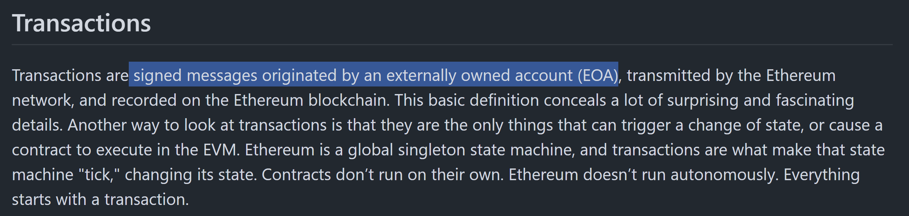

---
---

## Continue our journey

- Polymarket as an example

---
---

## Recap

- Transaction = change of state tree


<!-- TODO metmask flowchart -->


---

## demo polymarket


https://polymarket.com/

siwe request


## Proxy Wallet
- https://docs.polymarket.com/#proxy-wallets


---
---

## Step back...

- "Sign a Transaction"

- "Generaet a Private key"

- "Sign message to Sign in"

- "Sign an Attestation"

- How it happens under the hood


---
---

Themes

- Hard to attack. Trap door function
  - Quantum computing? 
- Size matters!


- Vitalik actually wrote very great premiers
  - [Finite field](https://vitalik.eth.limo/general/2024/04/29/binius.html#recap1)

<!-- I learn more from them than from my university -->


## Step back


---
---

## Hash (vs Encoding) vs Encryption 


[Ref: Hashing vs Encryption](https://www.okta.com/sg/identity-101/hashing-vs-encryption/)


---
---
# Hash
- SHA256
- keccak256 [Viem Example](https://viem.sh/docs/utilities/keccak256.html)

- [Live Demo](https://emn178.github.io/online-tools/keccak_256.html)

```ts
import { keccak256 } from 'viem'
 
keccak256(new Uint8Array([72, 101, 108, 108, 111, 32, 87, 111, 114, 108, 100, 33])
// 0x3ea2f1d0abf3fc66cf29eebb70cbd4e7fe762ef8a09bcc06c8edf641230afec0
 
// hash utf-8 string
keccak256(toHex('hello world'))
// 0x3ea2f1d0abf3fc66cf29eebb70cbd4e7fe762ef8a09bcc06c8edf641230afec0
```

---
---

# Encoding
  - base16=hex (0-9, A-F)
  - base64 (binary-text, 64 unique characters)

```ts
window.btoa("Hello, world!")

'SGVsbG8sIHdvcmxkIQ=='

```

  - [ABI Application Binary Interface (ABI)](https://docs.soliditylang.org/en/latest/abi-spec.html)
  - Recursive-length prefix (RLP) serialization [REF](https://ethereum.org/en/developers/docs/data-structures-and-encoding/rlp/)


```ts
import { fromRlp } from 'viem'
 
fromRlp('0x850123456789', 'hex')
// "0x123456789"

fromRlp('0xc67f7f838081e8', 'hex')
// ['0x7f', '0x7f', '0x8081e8']

```

---
---

## Encryption

- RSA


- Ethereum
  - secp256k1

- [Reading](https://www.dynamic.xyz/blog/everything-you-wanted-to-know-about-wallet-keys)


---
---

https://emn178.github.io/online-tools/ecdsa/key-generator/

[A (Relatively Easy To Understand) Primer on Elliptic Curve Cryptography](https://blog.cloudflare.com/a-relatively-easy-to-understand-primer-on-elliptic-curve-cryptography/)


---
---
- Private key

- Reference: 
[Mastering Ethereum, by Andreas M. Antonopoulos, Gavin Wood](https://github.com/ethereumbook/ethereumbook/blob/develop/04keys-addresses.asciidoc)


---
---

# ECC

- imagine our public keys are on the curve
  - `From the Keccak-256 hash of the public key, we take the last 20 bytes (160 bits) to obtain the EOA address.`


<!--  -->


## Q1.  Is that really secure?

- Someone come up with same private key (collision)?
  - extremely low 
- Deep state didn't add a backdoor?
  - secp256k1 proposed by Certicom not NSA/NIST
  - [2013 Dual EC, Snowden confiremd they did](https://blog.cryptographyengineering.com/2015/01/14/hopefully-last-post-ill-ever-write-on/)
- No one has access to powerful quantum computing 
  - human: Don't worry, won't happen overnight
  - 3body aliens: we're F~~xx~~ed anyway
- Correct, Safe Implementation
  - e.g. [legit, auditable supplychain in javascript](https://paulmillr.com/posts/noble-secp256k1-fast-ecc/)
  - e.g. CRNG


```
unlike the popular NIST curves, secp256k1's constants were selected in a predictable way, which significantly reduces the possibility that the curve's creator inserted any sort of backdoor into the curve.
```


---
---


- Actually, on field of modulus


---
---

# Digital Signature
- ~ Real life signature
- You can confirm someone authorized
  - non reputidation
  - e.g. When your investor ask to airdrop to wallet 0xabcde...
- private key to sign message (txn)
- verify signature with message & publicKey


- Attestation. "Someone make a statement"

## ECDSA 
- Elliptic Curve Digital Signature Algorithm (ECDSA) 

- use keys from Elliptic Curve Cryptography ECC

- Given signature (r,s,v) calculate Q on curve and verify r=x
“sign the Keccak-256 hash of the RLP-serialized transaction data.”


"Baes on the curve, find public key"

- `v,r,s` components
  - r as x coordinate
  - r^-1


## ECDSA

__Elliptic Curve__ Digital Signature Algorithm (ECDSA)



"Txn is the message"

```ts
kecca256(rlp(data))

{
  nonce,
  recipient,
  value,
  gasPrice,
  v,r,s // ecdsa signature
  ...
}

```
- nonce

---
---


## Again, Continue our journey

- sign vs connect

- types of data 

---
---

# You can Sign 
- Txn to transfer $, write to contract
- Txn to transfer $0 with a message
- Signature without Txn

---
---

# But What am I signing?
  


Ref: [Signature phishing](https://support.metamask.io/privacy-and-security/staying-safe-in-web3/signature-phishing/)

---
---


## Yes we have Standards

- [EIP-191](https://eips.ethereum.org/EIPS/eip-191)
- [EIP 712](https://eips.ethereum.org/EIPS/eip-712)
  - Typed structured data hashing and signing


---
---
- Demo
- [storybook]


---
---
# outro
- commonly used by Ethereum
- works well with zk circuits? "SNARK-friendly?"
- find those that work / invent some

- [use "secp256k1" curve](https://www.secg.org/sec2-v2.pdf)


---
---

You will see these often

```ts
export const getDomainSeparatorDefault = (config: TypedDataConfig) => {
	return keccak256(
		encodeAbiParameters(
			parseAbiParameters("bytes32,bytes32,bytes32,uint256,address"),
			[
				keccak256(toUtf8Bytes(EIP712_DOMAIN)) as Hex,
				keccak256(toUtf8Bytes(config.name)),
				keccak256(toUtf8Bytes(config.version)),
				config.chainId,
				config.address as Hex,
			],
		),
	);
};

```

```ts
import { encodeAbiParameters } from 'viem'
 
const encodedData = encodeAbiParameters(
  [
    { name: 'x', type: 'string' },
    { name: 'y', type: 'uint' },
    { name: 'z', type: 'bool' }
  ],
  ['wagmi', 420n, true]
)
// 0x0000000000000000000000000000000000000000000000000000000000000060
```

---
---

### Sign Typed Data

- [EIP-712: Typed structured data hashing and signing](https://eips.ethereum.org/EIPS/eip-712)


---
---

# Account Abstraction

- Proxy account

---
---
- Read Ch.6 Transaction of ["Mastering Ethereum"](https://github.com/ethereumbook/ethereumbook/blob/develop/06transactions.asciidoc#ecdsa_math)

- [Practical Cryptography for Developers]https://cryptobook.nakov.com/


---
---

Curve looks like


---
---

## EAS

- dissect

# https://sepolia.easscan.org/schema/view/0x3969bb076acfb992af54d51274c5c868641ca5344e1aacd0b1f5e4f80ac0822f

# Make a statement

# EAS is good example because it is simple but powerful 
