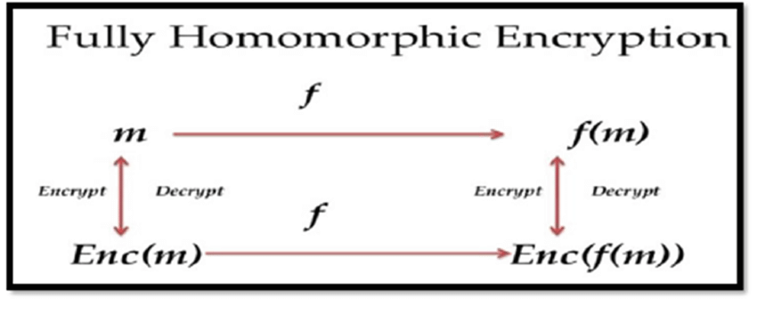

---
---

# FHE

## Textbook definition
Fully-homomorphic encryption (FHE) allows us to compute an arbitrary program over someone else’s private data, without learning anything about the data or the output of the computation.

## Textbook examples
- Hospital encrypt private patient data
- Companies offer service to analyze encrypted data for aggregated statistics

[A 6 minute introduction to Fully Homomorphic Encryption (FHE)](https://www.zama.ai/introduction-to-homomorphic-encryption)

---
---

# More personal example

- You send to accountant

---
---

# Homomorphism

- morph = (form, shape)
- isomorphism = ~identical
- homo = ~homogenous, same, similar 

- isomorphism != homomorphism

"Structure preserving map"

"At more abstract level, form stay unchanged after applying some functions"

---

# Fully Homorphic Encryption

---
---

---
---

## Demo

<!-- - Not generall true, say f(x) = -x -->

<!-- - Morning/Evening -->

---
---

- Challenges
  - EOD have to decrypt somewhere  https://medium.com/optalysys/the-distinction-between-fhe-and-tees-the-downfall-attack-a89eb5793d52

- Why now?
  - 2009 Fully Homomorphic Encryption Using Ideal Lattices
  - hardware
  - https://collective.flashbots.net/t/drawbacks-in-fhe-blockchain-and-how-tee-can-help-it/3642

---
---

  https://evervault.com/blog/deep-dive-on-fully-homomorphic-encryption-what-is-it-and-what-makes-it-different

---
---

# Conclusion

### Know enough

- drand projects: CICD
- "useable"

---
---

# Account abstraction != eip 4237

- Vitalik [since 2016](https://www.youtube.com/watch?v=iLf8qpOmxQc)
  - Ideal = launch Ethereum with All smart contract account, no EOA
- "Kind of AA" - Smart Contract Wallets Safe, Argent...
- Recall: Abstraction

<!--  -->

---
---

- Logically
  - Use Smart Contract to create powerful Account
  - Make EOA more like Smart Account

- Recent Work
  - EIP4337 = decentralized AA infra, UserOp, paymaster
      - gasless txn, session keys etc..
  - (Proposing) [EIP-7702 as alternative to EIP-3074](https://www.theblock.co/post/293074/vitalik-buterin-proposes-eip-7702-aiming-to-refine-account-abstraction-on-ethereum?modal=newsletter)

---
---

## Technology Tree

<!-- 
# use ZK-SNARKs for privacy

# - Vitalik: `Blockchains can make state information global, ZK-SNARKs can make state information private, but we don't really have any good way to make state information global and private at the same time.` -->

<!-- 
##  3 color maps
https://docs.google.com/presentation/d/17QuoDRTCNE8-DnFysZCyxpQvUA_1dEo7Hs1rgXhHHKA/edit#slide=id.g102e66aa652_0_257
 -->

"HE is like ZK for arbitrary functions"
- Here’s an output y and an arbitrary function f. I know a secret value x such that f(x) = y”

---
---
# attestations
# - Intuitive examples
#   - Voting

# - Why matters 
#   - video showing someone says something...